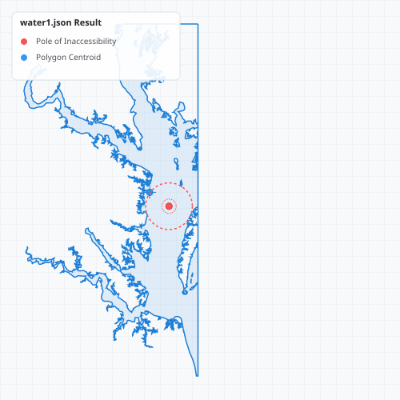
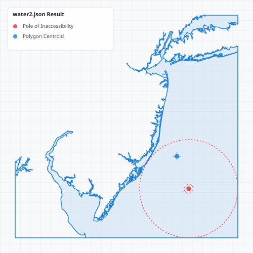

<p align="center">
  
</p>

<h1 align="center">PolylabelNet48</h1>

<p align="center">
  A <b>.NET Framework 4.8</b> port of <a href="https://github.com/oberbichler/PolylabelNet">PolylabelNet</a>
  (itself a C# port of <a href="https://github.com/mapbox/polylabel">Mapbox Polylabel</a>).
  Finds the <b>pole of inaccessibility</b> — the optimal point inside a polygon for label placement.
</p>

<p align="center">
  
  
  
</p>

## About This Port

The upstream [PolylabelNet](https://github.com/oberbichler/PolylabelNet) targets **.NET 8.0 / .NET 10.0**
and is distributed as the `Polylabel` NuGet package. Neither works on **.NET Framework 4.8**, which is
what this project requires. This is a source-level port that compiles and runs under .NET Framework 4.8
on the default **C# 7.3** language version, with the same public API and identical results.

See [Changes From Upstream](#changes-from-upstream) for the exact modifications.

## Key Features

* **.NET Framework 4.8 / C# 7.3 compatible** — no newer language or runtime features required.
* **No external dependencies** — references only the framework BCL (no `System.Memory`, no NuGet packages).
* **Flexible API:** native support for both raw `double[][][]` (GeoJSON-style) and the standard `Point` type.
* **Custom Point Support:** use your own point/vector struct with zero overhead via the generic API.

## Installation

Install the library directly from [NuGet](https://www.nuget.org/):

```bash
dotnet add package PolylabelNet48
```

Or via the Package Manager Console:

```powershell
Install-Package PolylabelNet48 
```

## Namespaces

| Type | Namespace |
| :--- | :--- |
| `Polylabel` (entry point) | `PolyLabelNet48` |
| `Point`, `Polygon`, `Polygon<TPoint>`, `PolylabelResult`, `IPoint`, `IPolygon<TPoint>` | `PolyLabelNet48.Models` |

```csharp
using PolyLabelNet48;          // Polylabel
using PolyLabelNet48.Models;   // Point, Polygon, PolylabelResult, IPoint, IPolygon<>
```

## Usage

A polygon is modeled as a list of closed rings. The first ring defines the outer boundary, while
subsequent optional rings define holes.

<p align="center">
  
</p>

```csharp
using PolyLabelNet48;
using PolyLabelNet48.Models;

// 1. Define a polygon with an outer ring and two holes (matching the diagram above)
var outerRing = new Point[]
{
    new Point(15, 15),
    new Point(135, 15),
    new Point(135, 135),
    new Point(15, 135),
    new Point(15, 15)
};

var holeA = new Point[]
{
    new Point(85, 35),
    new Point(125, 35),
    new Point(125, 85),
    new Point(85, 35)
};

var holeB = new Point[]
{
    new Point(25, 80),
    new Point(55, 80),
    new Point(55, 125),
    new Point(25, 125),
    new Point(25, 80)
};

var polygon = new Polygon(new Point[][] { outerRing, holeA, holeB });

// 2. Find the pole of inaccessibility
var (point, distance) = Polylabel.Run(polygon, precision: 0.01);

Console.WriteLine($"Optimal label position: X={point.X}, Y={point.Y}"); // Output: X=90.7, Y=99.3
Console.WriteLine($"Distance to closest boundary: {distance}");         // Output: Distance=35.7
```

`Polylabel.Run` returns a `PolylabelResult`, which deconstructs into `(Point point, double distance)`
as shown, or can be used directly via its `Point` and `Distance` properties.

## From Mapbox Documentation
Given polygon coordinates in GeoJSON-like format (an array of arrays of [x, y] points) and precision (1.0 by default), Polylabel returns the pole of inaccessibility coordinate in [x, y] format. The distance to the closest polygon point (in input units) is included as a distance property.

const p = polylabel([[[0, 0], [1, 0], ...]], 1.0);
const distance = p.distance;
Be careful to pick precision appropriate for the input units. E.g. in case of geographic coordinates (longitude and latitude), `0.000001` is appropriate, while the default `(1.0)` would be too imprecise.

### Interoperability

Raw coordinate arrays (e.g. straight from a GeoJSON serializer) are handled directly:

```csharp
double[][][] geoJsonCoordinates = ...; // outer boundary and hole coordinates
var polygon = new Polygon(geoJsonCoordinates);

var (point, distance) = Polylabel.Run(polygon, precision: 0.1);
```

### Custom Types

If your application already uses its own point/vector struct, implement the `IPoint` interface on it and
pass it to a generic `Polygon<TPoint>` — the compiler generates zero-overhead, specialized code paths:

```csharp
using PolyLabelNet48.Models;

// 1. Implement IPoint on your custom struct
public readonly struct CustomVector2 : IPoint
{
    public double X => XCoordinate;
    public double Y => YCoordinate;

    public double XCoordinate { get; }
    public double YCoordinate { get; }

    public CustomVector2(double x, double y)
    {
        XCoordinate = x;
        YCoordinate = y;
    }
}

// 2. Wrap custom coordinates in a generic Polygon
CustomVector2[][] myRings = ...;
var polygon = new Polygon<CustomVector2>(myRings);

// 3. Find the pole
var (point, distance) = Polylabel.Run(polygon, precision: 1.0);
```

For a point type from an external package that you cannot modify, define a lightweight adapter struct:

```csharp
using System.Numerics; // e.g. Vector2 (requires the System.Numerics.Vectors assembly on .NET Framework)
using PolyLabelNet48.Models;

public readonly struct Vector2Adapter : IPoint
{
    private readonly Vector2 _vector;

    public double X => _vector.X;
    public double Y => _vector.Y;

    public Vector2Adapter(Vector2 vector) => _vector = vector;
}

Vector2[][] externalRings = ...;
Vector2Adapter[][] wrappedRings = Array.ConvertAll(externalRings,
    ring => Array.ConvertAll(ring, v => new Vector2Adapter(v)));

var polygon = new Polygon<Vector2Adapter>(wrappedRings);
var (point, distance) = Polylabel.Run(polygon);
```

You can also implement the generic `IPolygon<TPoint>` interface to drive the algorithm directly off your
own container. Note that in this port `GetRing` returns a **`TPoint[]`** array (see
[Changes From Upstream](#changes-from-upstream)):

```csharp
using System;
using PolyLabelNet48.Models;

public readonly struct MyCustomPolygon : IPolygon<Point>
{
    private readonly Point[] _outerRing;

    public int RingCount => 1;

    public Point[] GetRing(int index) => index == 0 ? _outerRing : Array.Empty<Point>();

    public MyCustomPolygon(Point[] outerRing) => _outerRing = outerRing;
}

var polygon = new MyCustomPolygon(outerRingPoints);
var (point, distance) = Polylabel.Run<MyCustomPolygon, Point>(polygon);
```

## Changes From Upstream

To run on .NET Framework 4.8 / C# 7.3, the following changes were made versus the original PolylabelNet.
All produce identical results to the original algorithm.

| Area | Upstream (net8.0/net10.0) | This port (net48 / C# 7.3) |
| :--- | :--- | :--- |
| **Priority queue** | `System.Collections.Generic.PriorityQueue<Cell, double>` (.NET 6+) | `Tinyqueue<T>` — a binary-heap port of the original JS `tinyqueue`, since .NET Framework has no built-in `PriorityQueue`. The `ICellQueue` abstraction is preserved; `NativeCellQueue`/`MaxDoubleComparer` were removed in favor of `TinyCellQueue`. |
| **Ring access** | `ReadOnlySpan<TPoint> GetRing(int)` | `TPoint[] GetRing(int)` — avoids the `System.Memory` dependency on .NET Framework. `GetRing` returns the backing array directly, so there is still no copy. |
| **Queue wrapper type** | `readonly struct` cell queue | `TinyCellQueue` is a `class` (C# 7.3 forbids parameterless struct constructors). The `RunCore` constraint was relaxed from `where TCellQueue : struct, ICellQueue` to `where TCellQueue : ICellQueue`. |
| **Language syntax** | File-scoped namespaces, `^` index-from-end, nullable annotations | Block-scoped namespaces, `list[count - 1]` indexing, nullable annotations removed. |
| **Namespacing** | `Polylabel` | Entry point `Polylabel` in `PolyLabelNet48`; value/geometry types in `PolyLabelNet48.Models`. |

> **Note on allocations:** Upstream advertises a near-zero-allocation hot loop. Because the cell queue
> here is a `class`, each `Polylabel.Run` call performs one small heap allocation for the queue wrapper
> (plus the heap's internal `List<Cell>` buffer) — negligible in practice, and the per-probe inner loop
> remains allocation-free.

## Visual Results

Below are results from the upstream test/benchmark datasets. Notice how the polygon centroid (blue cross)
often falls outside the shape or in a suboptimal narrow area, whereas the pole of inaccessibility (red
circle and its concentric maximum-distance circle) finds the optimal interior point.

<p align="center">
  
  
</p>

## Benchmarks

This port has not been independently re-benchmarked. The numbers below are from the **upstream** project
(Apple M1 Pro, .NET 10.0) and are included for reference only:

| Benchmark Case | Polygon Complexity | Precision | Mean Time | Pole (Result) |
| :--- | :--- | :--- | :--- | :--- |
| `Water1` (GIS) | 25 Rings, 3,073 Vertices | `1.0` | 7.77 ms | `[3865.85, 2124.88]` (dist 288.85) |
| `Water2` (GIS) | 28 Rings, 2,831 Vertices | `1.0` | 3.34 ms | `[3263.50, 3263.50]` (dist 960.50) |

Upstream also reports the `PriorityQueue` and `tinyqueue` implementations to be roughly equally fast — the
queue this port uses is the latter.

## License

Licensed under the **ISC License** — see the [LICENSE](LICENSE.txt) file for details.
Original algorithm copyright (c) 2016 Mapbox. PolylabelNet by Thomas Oberbichler.
